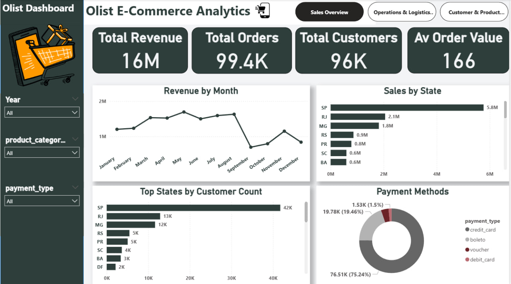
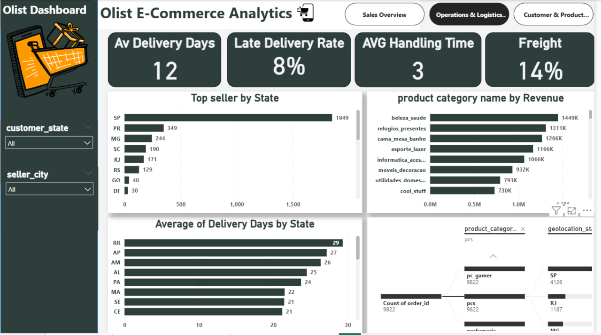
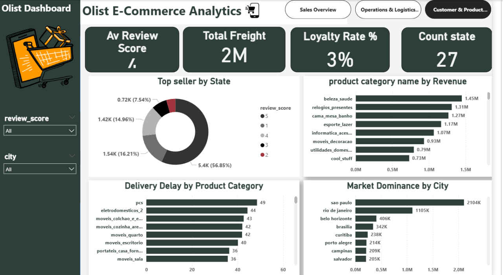
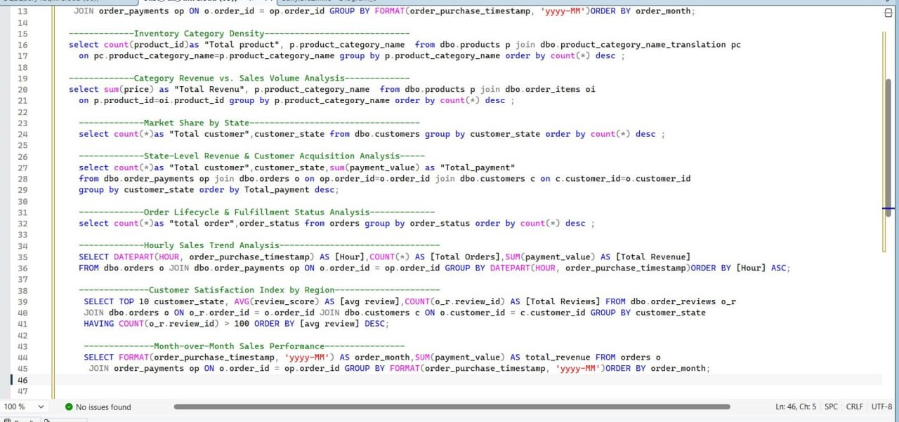
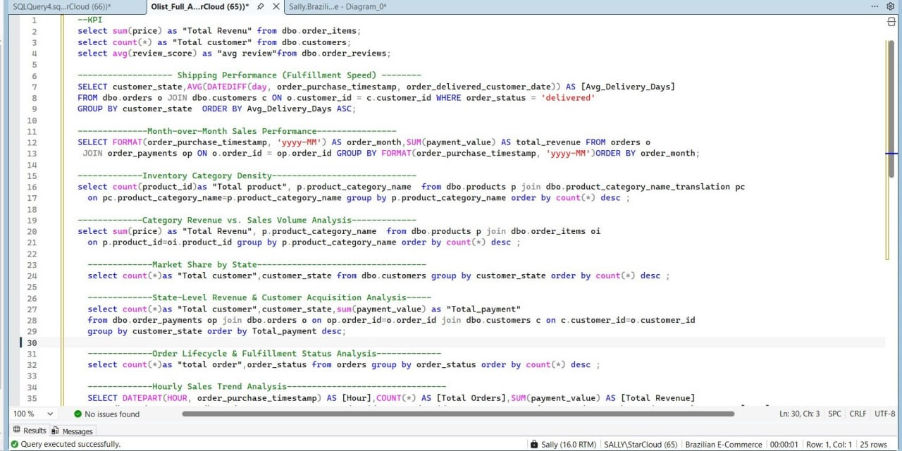
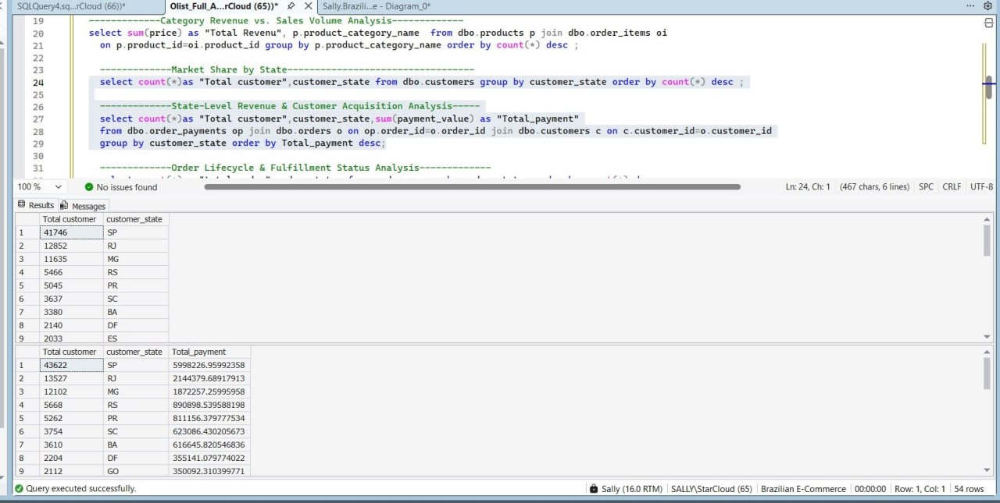
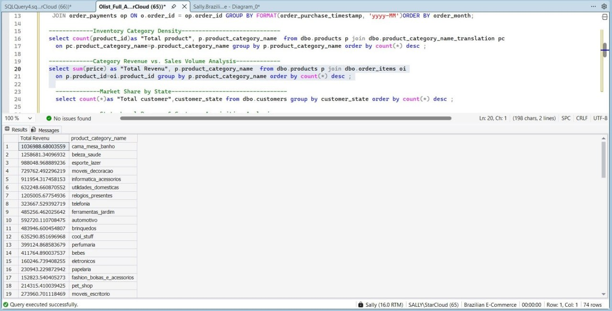
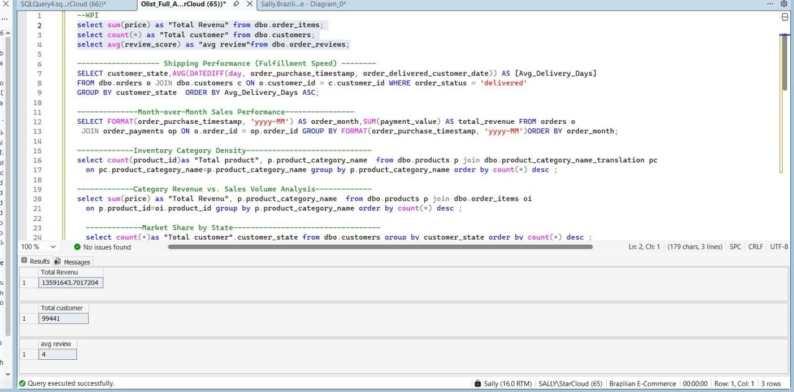

# 🛒 Olist E-Commerce Business Intelligence & Strategic Optimization Case Study

## 1. 📊 Interactive Dashboard Overview

---

## 2. 📝 Executive Summary & Business Context
Olist operates as a major e-commerce marketplace in Brazil, connecting small sellers with nationwide buyers. This analysis investigates **99k+ historical orders** to resolve key operational bottlenecks: severe fulfillment delays in remote regions, revenue dependency on limited geographic hubs, and revenue drop-offs during off-peak hours.

### 📈 Core Business KPIs:
* **Total Gross Revenue:** ~$13.59 Million
* **Total Customer Base:** 99,441 Active Buyers
* **Customer Satisfaction Index:** 4.0 / 5.0 Avg Review Score
* **Fulfillment Success Rate:** 96,478 Delivered Orders (27 States)

---

## 3. 🎯 Business Problems, Analytical Insights & Solutions

### 🔴 Problem 1: High Delivery Lead Times in Northern & Northeastern States
* **Analytical Finding:** While São Paulo (SP) achieves an average fulfillment speed of **8 days**, distant states like Acre (AC) and Sergipe (SE) suffer from delays reaching **20 to 21 days**.
* **Impact:** High delivery duration directly degrades review scores in non-metro regions.
* **Strategic Action:** Establish regional micro-fulfillment distribution hubs in Brazil's Northeast (e.g., Bahia/Pernambuco) to compress fulfillment times from 21 days down to under 11 days.

### 🔴 Problem 2: Over-Centralization of Revenue & Geographic Vulnerability
* **Analytical Finding:** Over **44% of total revenue ($5.99M+)** and customer concentration is locked within São Paulo (SP).
* **Impact:** The business model faces significant operational risk if supply chain disruptions occur within the SP region.
* **Strategic Action:** Implement targeted seller-acquisition incentives in secondary markets (Minas Gerais & Rio de Janeiro) and offer subsidized shipping tiers to expand market share outside SP.

### 🔴 Problem 3: Unused Off-Peak Conversion Opportunities
* **Analytical Finding:** Hourly trend analysis demonstrates massive conversion spikes between **10:00 AM and 4:00 PM** ($1M+ revenue/hour), with drastic drop-offs during early morning hours.
* **Impact:** Server infrastructure and customer support resources remain idle during off-peak periods.
* **Strategic Action:** Schedule automated, personalized promotional push notifications and flash-sales during low-traffic windows (6:00 AM - 9:00 AM) to flatten the order-volume curve.

---

## 🛠️ 4. SQL Logic Validation & Technical Architecture

The data extraction and business logic were validated on SQL Server using optimized queries (`JOIN`s, `DATEDIFF`, `DATEPART`, and window functions):

---

## 📂 Repository Contents
* `olist_dashboard*.jpg.jpg`: High-resolution Power BI dashboard previews.
* `olist_queries*.sql.jpg.jpg`: Verified SQL Server queries and execution results.
